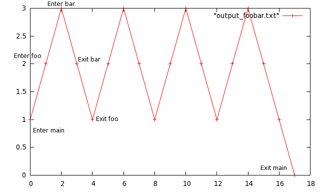
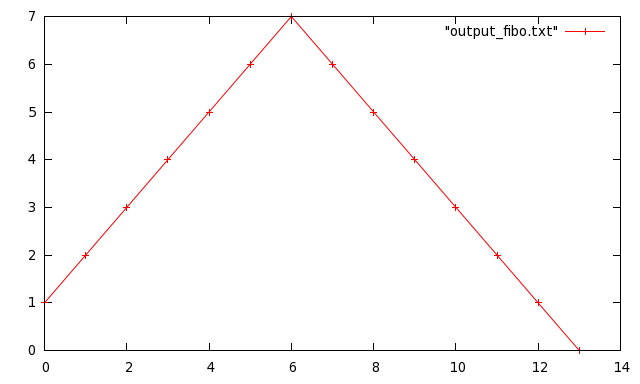

# Counting stack depth in C with GCC

## About 
I was curious about how the stack depth of C program grew
over the life of the program.  Languages like python make answering
questions like this pretty easy; I thought C was going to be nearly
impossible.  Fortunatly as quick Google search pointed me to a
StackOverflow question that had just what i was looking for.  This
simple project demos my findings.

## How 
GCC is a wonderful tool.  It provides a
`-finstrument-functions` command line switch that allows you to write
your own hooks that get called anytime a function is entered or
exited.  The
[documentation](http://gcc.gnu.org/onlinedocs/gcc/Code-Gen-Options.html)
tells us the signatures of the functions:

    void __cyg_profile_func_enter(void *this_fn, void *call_site);
    void __cyg_profile_func_exit(void *this_fn, void *call_site);

All we have to do is define these functions and like our program with
the `-finstrument-functions` option.  GCC will insert calls to these
two methods every time one of our program's functions is called.  

At this point the only question is: "How do we keep GCC from calling
one of these functions every time it calls one of these functions?".
Exellent question, one I should have thought of before I ran my
program the first time... Anyway, GCC again comes to the rescue with the
`no_instrument_function` function attribute.  Adding this to the
function signature will tell GCC that we don't want these particular
functions to be instrumented.  So our final instrumentation function
signatures look like:

    void __attribute__((no_instrument_function)) __cyg_profile_func_enter(void *this_fn, void *call_site);
    void __attribute__((no_instrument_function)) __cyg_profile_func_exit(void *this_fn, void *call_site);

We could also have used the
`-finstrument-functions-exclude-file-list=_file_` switch when we
compiled the file containing our instrumentation functions.

## On with the results already!
I wanted to keep it simple and just run a few tests.  The first
program I ran looks like this:

    ...
    void foo();
    void bar();
    
    int main(int argc, char** argv)
    {
        int i;
    
        printf("calling foo 4 times\n");
    
        for (i = 0; i < 4; i++) {
            foo(4);
        }
    
        return 0;
    }
    
    void foo()
    {
        bar();
    }
    
    void bar()
    {
        
    }

Pretty simple.  And our instrumentation functions look like this:

    ...
    void __cyg_profile_func_enter(void *this_fn, void *call_site)
    {
        levels[total++] = ++depth;
    }
    
    void __cyg_profile_func_exit(void *this_fn, void *call_site)
    {
        levels[total++] = --depth;
    
        /* print the results as we exit main... */
        if (depth == 0) {
            int i;
    
            printf("Total enters/exits: %d\n", total);
            printf("Total function calls: %d\n", total / 2);
            printf("Stack depth level trace:\n");
            for (i = 0; i < total; i++) {
                printf("%d\n", levels[i]);
            }
        }
    }

Where `total`, `depth` and the `levels` array are file local global
variables.  So every time a function is called we record the current
stack depth in the `levels` array.  Just after we exit `main` we print
out the results of our excursion.  

    [dav@laptop] stack_count% make
    gcc -Wall -g -finstrument-functions -c -o stack_count.o stack_count.c
    gcc -Wall -g -finstrument-functions -c -o instrumenter.o instrumenter.c
    gcc -Wall -g -finstrument-functions -o prog stack_count.o instrumenter.o
    [dav@laptop] stack_count% ./prog 
    calling foo 4 times
    Total enters/exits: 18
    Total function calls: 9
    Stack depth level trace:
    1
    2
    3
    2
    1
    2
    3
    2
    1
    2
    3
    2
    1
    2
    3
    2
    1
    0

From this we can see how deep the stack got and how many function
calls were made.  

## How about some pictures?
The original point of this exercise was to make a graph of the stack
depth over the course of the program.  With just a little bit of
`gnuplot` we can make that happen:

    [dav@laptop] stack_count% ./prog > output_foobar.txt
    [dav@laptop] stack_count% gnuplot                   
    gnuplot> plot "output_foobar.txt" with linespoints

And there we go (with annotations): 

And here is another one of a recursive Fibonacci function:

## Conclusion 
GCC is way more than a compiler, it has lots of awesome
abilities.  One of these days I will have to try a larger program in
action.  It would also be interesting to see what happens in a
multi-threaded application.  As a side note, if anybody knows of a
fancy way to store the excursion levels, let me know!  I don't think a
static array of `int`'s is going to cut it for larger programs...
